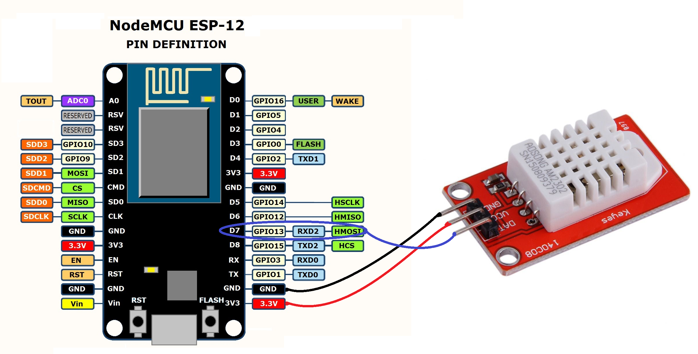
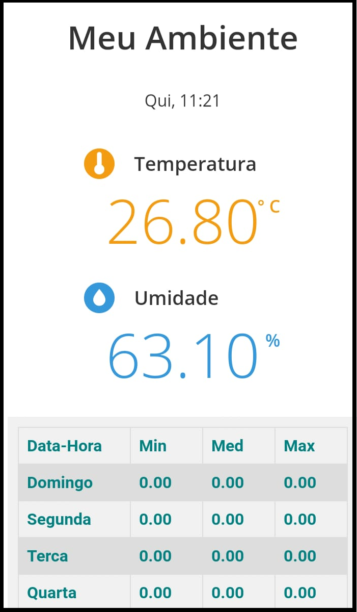

# Introduction
This project was intended to be a temperature and humidity web server. It was developed using ESP12F and a DHT22 sensor.
The main page shows the temperature and the humidity using a beautiful text and icone. In order to be more useful the actual time, synchronized by a NTP server, is also displayed in the main page. 
A log of maximum, minimum and medium temperature of an entire week is stored in a table in the main page.

Table example: 
| Week Days | Min | Med | Max |
|-----------|-----|-----|-----|
| Sunday    | 10  | 20  | 30  |
| Monday    | 11  | 21  | 31  |
| Tuesday   | 12  | 22  | 32  |
| Wednesday | 13  | 23  | 30  |
| Thursday  | 14  | 24  | 30  |
| Friday    | 15  | 23  | 30  |
| Saturday  | 15  | 23  | 30  |

# Hardware

# APP 
When the device start it looks for a known WiFi network and if it isn't avaiable a server will be opened at 192.168.4.1 adress. 
The WiFi name will be **ESP_Inventus** and the pass phrase to acess it is **inventus**.
After connect in this server, you will be able to configure the desired WiFi that the device will be connected and you can give a name to distinguish between two or more devices. This name can be the local where this device will be monitoring, for example, my_room. Once it is done with **sucess** restart your device. 
You can connect in your device using the url **http://my_room/** to see the main page (if it not work, restart your router, too).
Once it is configured is possible to reconfigure the network parameters and the name of the device through the  url **http://my_room/reconfig**.

